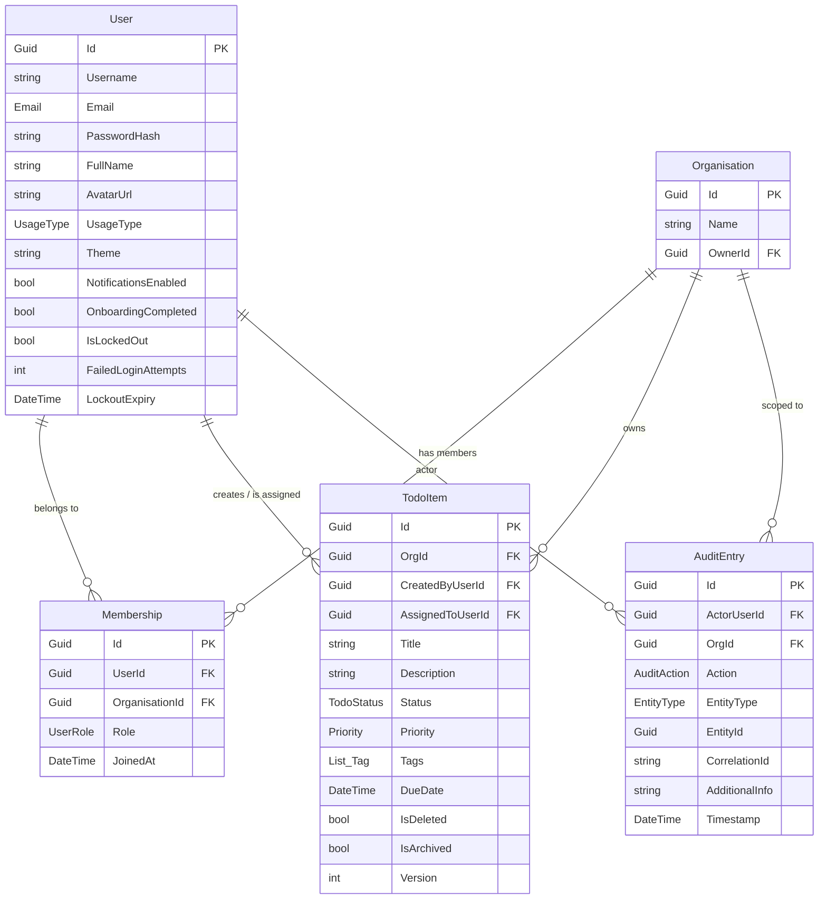
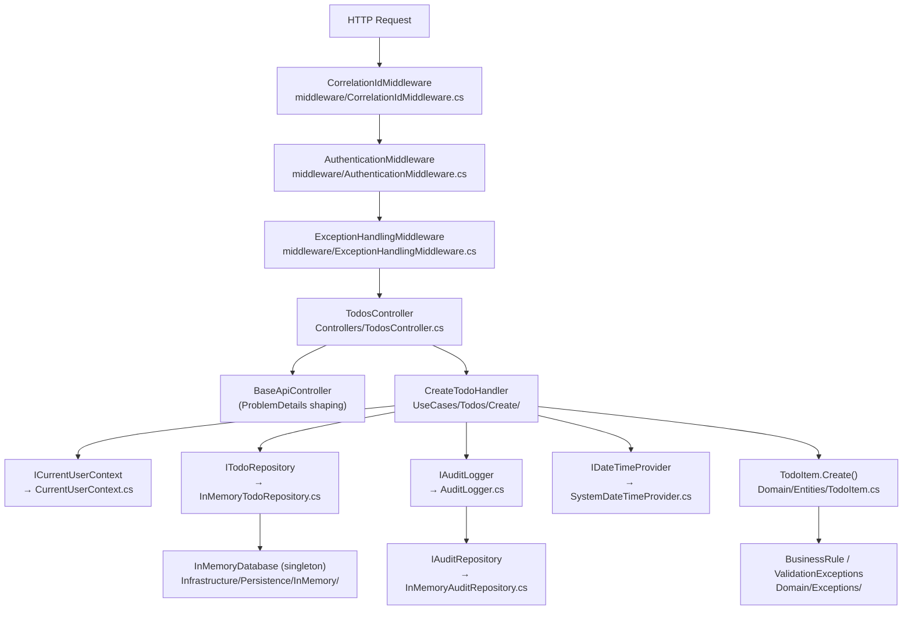

# TaskHub Backend — Architecture Analysis

> **.NET 10 · Clean Architecture · In-Memory + File Persistence · Session-Cookie Auth**

---

## 1. Entity Relationships

These are the five core domain entities living in `TaskHub.Domain/Entities/`.



### Entity Notes

| Entity | Role | Key Traits |
|---|---|---|
| **User** | Auth principal + profile | Lockout after 5 failed logins (15-min window), email as `ValueObject`, `OnboardingCompleted` flag gate |
| **Organisation** | Multi-tenant boundary | Todos and membership are always scoped to an org |
| **Membership** | Join table for User ↔ Organisation | Carries a `UserRole` (`Owner` / `Admin` / [Member](file:///Users/oparagregory/Desktop/projects/TaskHub/server/src/TaskHub.Domain/Entities/Membership.cs#14-16)) |
| **TodoItem** | Core work item | Soft-delete + archive as separate lifecycle states, optimistic concurrency via `Version` field |
| **AuditEntry** | Append-only activity log | Records actor, target entity, action, correlation ID per request |

---

## 2. Activity-Level File Relationships

How the files talk to each other at runtime for a typical request (e.g. **Create Todo**):



### Middleware Pipeline (in order)

| Order | Middleware | What it does |
|---|---|---|
| 1 | `CorrelationIdMiddleware` | Reads or generates `X-Correlation-ID` header; stores in `HttpContext.Items["CorrelationId"]` |
| 2 | [AuthenticationMiddleware](file:///Users/oparagregory/Desktop/projects/TaskHub/server/src/TaskHub.Api/Middleware/AuthenticationMiddleware.cs#10-14) | Reads `session_token` cookie → validates session → populates `UserId`, `ActiveOrgId`, `IsAuthenticated` into `HttpContext.Items` |
| 3 | [ExceptionHandlingMiddleware](file:///Users/oparagregory/Desktop/projects/TaskHub/server/src/TaskHub.Api/Middleware/ExceptionHandlingMiddleware.cs#6-134) | Catches all unhandled exceptions; maps domain exceptions to RFC 7807 Problem Details with the correlation ID attached |

### Request → Response Flow for Every Use Case

```
Controller
  └─ Injects typed Handler (e.g. CreateTodoHandler)
       └─ Handler reads ICurrentUserContext (UserId/OrgId from HttpContext)
            └─ Calls Domain entity static factory (validates & enforces rules)
                 └─ Persists via IRepository interface
                      └─ Fire-and-forget IAuditLogger.LogAsync(...)
                           └─ Returns Result<T> → mapped to HTTP response by BaseApiController
```

---

## 3. Current Architecture

### Pattern: Clean Architecture (4 Layers)

```
┌──────────────────────────────────────────────────────────┐
│  TaskHub.Api          (HTTP entry point)                  │
│  Controllers · Middleware · BaseApiController             │
├──────────────────────────────────────────────────────────┤
│  TaskHub.Application  (Use-case orchestration)           │
│  UseCases/{feature}/{action}/Handler, Command/Query       │
│  Common/Interfaces: IRepository, IDateTimeProvider…      │
├──────────────────────────────────────────────────────────┤
│  TaskHub.Infrastructure  (Side-effect implementations)   │
│  InMemoryDatabase · FileRepositories · BCrypt · AuditLogger │
│  CurrentUserContext · BackgroundJob (ArchiveJob)          │
├──────────────────────────────────────────────────────────┤
│  TaskHub.Domain  (Pure business rules, no dependencies)  │
│  Entities · Enums · ValueObjects · Exceptions            │
└──────────────────────────────────────────────────────────┘
       Dependency direction: Api → Application → Domain
                             Infrastructure → Application → Domain
```

### Application Layer — Use-Case Inventory

| Feature area | Use cases |
|---|---|
| **Auth** | Register · Login · Logout |
| **Onboarding** | CompleteOnboarding |
| **Todos** | Create · Update · ToggleStatus · SoftDelete · HardDelete · Restore · List · Archive |
| **Organisations** | Create · AddMember · RemoveMember · ChangeRole · ListUserOrgs · ListMembers · SetActiveOrg |
| **Audit** | List |
| **Import/Export** | Export · Import |

Each use case lives in its own subfolder and follows a consistent structure:
- `{Action}Command.cs` / `{Action}Query.cs` — input DTO (record)
- `{Action}Handler.cs` — orchestration logic
- `{Action}Response.cs` — output DTO (optional)
- `{Action}Validator.cs` — input validation (optional)

### Authentication Model

- **No JWT**. Session-based with a `Session` entity stored in the session repository.
- Login creates a session token → set as an `HttpOnly` cookie (`session_token`).
- [AuthenticationMiddleware](file:///Users/oparagregory/Desktop/projects/TaskHub/server/src/TaskHub.Api/Middleware/AuthenticationMiddleware.cs#10-14) validates the cookie on every request and hydrates `ICurrentUserContext`.
- Lockout: 5 failed login attempts trigger a 15-minute account lock enforced in `User.RecordFailedLogin()`.

### Persistence Strategy

Two concrete persistence implementations exist, both implementing the same `IRepository<T>` interface:

| Strategy | Location | When used |
|---|---|---|
| **InMemory** (`InMemoryDatabase` singleton) | `Infrastructure/Persistence/InMemory/` | Running server (default, registered in [Program.cs](file:///Users/oparagregory/Desktop/projects/TaskHub/server/src/TaskHub.Api/Program.cs)) |
| **File-based** (JSON on disk) | `Infrastructure/Persistence/File/` | Not currently wired in DI — exists as an alternative / migration target |

> [!NOTE]
> The `InMemoryDatabase` is registered as a **singleton** while handlers are **scoped**, so all concurrent requests share the same in-memory store. Thread-safety depends on `ConcurrentDictionary` usage inside the repositories.

### RBAC

`UserRole` enum (`Owner`, `Admin`, [Member](file:///Users/oparagregory/Desktop/projects/TaskHub/server/src/TaskHub.Domain/Entities/Membership.cs#14-16)) carried on [Membership](file:///Users/oparagregory/Desktop/projects/TaskHub/server/src/TaskHub.Domain/Entities/Membership.cs#14-16). Authorization checks (e.g. only Admin+ can add members) are enforced inside handlers before calling domain methods.

### Concurrency Control

[TodoItem](file:///Users/oparagregory/Desktop/projects/TaskHub/server/src/TaskHub.Domain/Entities/TodoItem.cs#8-221) has a `Version` integer. On update/delete the client must pass the current version. If the stored version differs, a `ConcurrencyConflictException` is thrown → HTTP 412.

### Background Job

`ArchiveJob` (hosted service): a periodic job that auto-archives todos past a configurable threshold. Configured via [appsettings.json](file:///Users/oparagregory/Desktop/projects/TaskHub/server/src/TaskHub.Api/appsettings.json) [Archive](file:///Users/oparagregory/Desktop/projects/TaskHub/server/src/TaskHub.Domain/Entities/TodoItem.cs#151-168) section.

---

## 4. Alternative Architectures

### Option A — Vertical Slice Architecture

Instead of horizontal layers (Domain / Application / Infrastructure), organise **everything for one feature into one folder**.

```
Features/
  Todos/
    Create/
      CreateTodoEndpoint.cs   ← maps route
      CreateTodoCommand.cs
      CreateTodoHandler.cs
      TodoValidator.cs
      TodoResponse.cs
      ITodoStore.cs           ← feature-local interface
      SqlTodoStore.cs         ← concrete impl right here
```

**vs current**: Today you already have the use-case folders almost looking like this. The difference is that your `IRepository` interfaces and domain entities are still shared horizontally. Vertical slices would push even those per-feature, maximising independence.

---

### Option B — CQRS + MediatR

Swap the manual `Handler` injection for **MediatR**. Each command/query implements `IRequest<T>` and is dispatched via `_mediator.Send(command)`.

```csharp
// Instead of injecting 8 handlers in TodosController:
var result = await _mediator.Send(new CreateTodoCommand(...));
```

Pipeline behaviours replace custom validation/audit wiring:
```
LoggingBehaviour → ValidationBehaviour → AuthorisationBehaviour → Handler
```

**vs current**: You effectively have CQRS in spirit (Commands vs Queries are separated), but without MediatR's pipeline. Your version avoids the MediatR dependency but requires all handlers to be manually wired in [Program.cs](file:///Users/oparagregory/Desktop/projects/TaskHub/server/src/TaskHub.Api/Program.cs).

---

### Option C — Minimal APIs (no Controllers)

Replace MVC controllers with inline `app.MapPost(...)` endpoint definitions, leaning on ASP.NET Minimal APIs.

```csharp
app.MapPost("/api/v1/todos", async (CreateTodoCommand cmd, CreateTodoHandler h) => {
    var result = await h.HandleAsync(cmd);
    return result.IsSuccess ? Results.Created(result.Value) : Results.BadRequest(result);
});
```

**vs current**: More concise, but you lose the inheritance-based [BaseApiController](file:///Users/oparagregory/Desktop/projects/TaskHub/server/src/TaskHub.Api/Controllers/BaseApiController.cs#6-73) ProblemDetails shaping. You'd move that logic to extension methods or result filters.

---

### Option D — Event-Driven / Outbox Pattern

[BaseEntity](file:///Users/oparagregory/Desktop/projects/TaskHub/server/src/TaskHub.Domain/Common/BaseEntity.cs#3-21) already has a [DomainEvents](file:///Users/oparagregory/Desktop/projects/TaskHub/server/src/TaskHub.Domain/Common/BaseEntity.cs#16-20) list and [AddDomainEvent()](file:///Users/oparagregory/Desktop/projects/TaskHub/server/src/TaskHub.Domain/Common/BaseEntity.cs#11-15) / [ClearDomainEvents()](file:///Users/oparagregory/Desktop/projects/TaskHub/server/src/TaskHub.Domain/Common/BaseEntity.cs#16-20) plumbing — but domain events are **never raised today**.

A full event-driven approach would:
1. Entities raise events (`TodoCreated`, `MemberAdded`).
2. After repository save, a dispatcher publishes them in-process (or to a message bus).
3. Audit logging becomes an event handler, not a direct call inside handlers.

**vs current**: Audit is today written imperatively inside each handler. An event-driven approach decouples it completely but adds significant complexity.

---

### Option E — Database-backed Persistence (Entity Framework Core)

Replace `InMemoryDatabase` / file repos with EF Core + PostgreSQL/SQL Server. The `IRepository<T>` interface already exists — it's a straight swap.

```csharp
// Now:
builder.Services.AddScoped<ITodoRepository, InMemoryTodoRepository>();
// With EF:
builder.Services.AddScoped<ITodoRepository, EfTodoRepository>();
builder.Services.AddDbContext<TaskHubDbContext>(...);
```

**vs current**: Data survives restarts, supports real queries, joins, and migrations. The file-based repositories in `Infrastructure/Persistence/File/` suggest this migration was already planned.

---

## 5. Trade-offs: Current vs Alternatives

| Concern | Current approach | Alternative | Trade-off |
|---|---|---|---|
| **Data durability** | In-memory (lost on restart) | EF Core + DB | ✅ Simple dev setup · ❌ No persistence across restarts |
| **Handler discovery** | Manual DI in [Program.cs](file:///Users/oparagregory/Desktop/projects/TaskHub/server/src/TaskHub.Api/Program.cs) (25+ `AddScoped` lines) | MediatR auto-scan | ✅ No magic, fully explicit · ❌ Boilerplate grows with every new use case |
| **Request pipeline** | Inline code in each handler (auth check, audit call) | MediatR pipeline behaviours | ✅ Easy to debug step-by-step · ❌ Cross-cutting concerns are scattered |
| **Authentication** | Custom session-cookie middleware | ASP.NET Core `[Authorize]` + JWT | ✅ Simple, no token refresh complexity · ❌ Not stateless (session store required), no standard claims integration |
| **Audit logging** | Direct call to `IAuditLogger` inside every handler | Domain events + dispatcher | ✅ Straightforward to trace · ❌ Auditability depends on developers remembering to call it |
| **Validation** | Mix of domain exceptions + optional per-handler validators | FluentValidation pipeline behaviour | ✅ Validation lives with business rules · ❌ Inconsistent — some handlers have explicit validators, some rely purely on domain |
| **Concurrency** | Optimistic versioning (`Version` integer on [TodoItem](file:///Users/oparagregory/Desktop/projects/TaskHub/server/src/TaskHub.Domain/Entities/TodoItem.cs#8-221)) | DB-level row locking / ETag | ✅ Works without a DB · ❌ Manual; client must track version number |
| **Persistence abstraction** | Repository pattern via interfaces | Active Record / EF DbSet directly | ✅ Swappable (proven by dual InMemory+File impl) · ❌ Adds a layer of indirection |
| **Error surfacing** | `Result<T>` value objects returned from handlers | Exceptions everywhere | ✅ Explicit, composable · ❌ Mix of `Result<T>` returns *and* thrown domain exceptions creates two error flows |
| **Code organisation** | Horizontal layers + vertical use-case sub-folders | Pure vertical slices | ✅ Familiar Clean Architecture structure · ❌ Feature changes touch multiple projects |

---

## 6. Libraries Used

### `TaskHub.Api`

| Library | Version | Purpose |
|---|---|---|
| `Microsoft.AspNetCore` (framework) | .NET 10 | HTTP pipeline, controllers, middleware, routing, DI |
| `Swashbuckle.AspNetCore` (implied) | — | Swagger/OpenAPI UI at `/swagger` |
| `System.Text.Json` | built-in | JSON serialisation with camelCase + enum-as-string |

### `TaskHub.Infrastructure`

| Library | Version | Purpose |
|---|---|---|
| **BCrypt.Net-Next** | 4.1.0 | Password hashing (bcrypt algorithm) via `BcryptPasswordHasher` |
| `Microsoft.AspNetCore.Http` | 2.3.9 | `IHttpContextAccessor` for `CurrentUserContext` |
| `Microsoft.Extensions.DependencyInjection` | 10.0.3 | Service registration interfaces |
| `Microsoft.Extensions.Hosting.Abstractions` | 10.0.3 | `IHostedService` for `ArchiveJob` background job |
| `Microsoft.Extensions.Logging.Abstractions` | 10.0.3 | `ILogger<T>` in [ExceptionHandlingMiddleware](file:///Users/oparagregory/Desktop/projects/TaskHub/server/src/TaskHub.Api/Middleware/ExceptionHandlingMiddleware.cs#6-134) and `AuditLogger` |
| `Microsoft.Extensions.Options` | 10.0.3 | `IOptions<ArchiveOptions>` for background job configuration |

### `TaskHub.Application` & `TaskHub.Domain`

> These projects have **zero third-party NuGet packages** — a deliberate choice to keep the business core dependency-free. All types are pure C# (`record`, `sealed class`, etc.).

---

## Summary

TaskHub's backend is a textbook **Clean Architecture** implementation in .NET 10. The domain has rich behaviour baked into the entities themselves (factory methods, guard methods, versioning), and the application layer is pure orchestration with no framework bleed-through. The key architectural bets made are:

- **Session-cookie auth over JWT** — simpler, but stateful
- **Manual handler wiring over MediatR** — explicit, but verbose at scale
- **In-memory storage** (with a file-based alternative ready) — ideal for a technical exercise, not production-ready
- **Result\<T\> + domain exceptions dual error model** — functional in practice but inconsistent in style
- **Domain events scaffolded but unused** — the plumbing for an event-driven audit is there (`BaseEntity.DomainEvents`), but never activated
